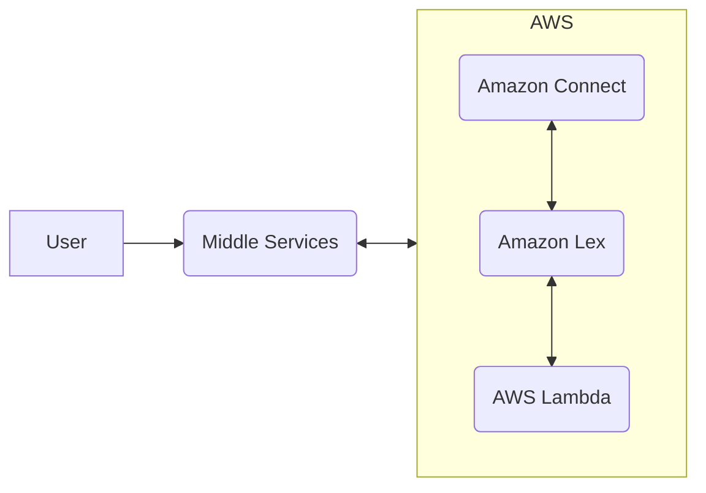

## 🖼 Tech Stack 
---


**User**: Phone Calls, Chat Bot
**Middle Services**: Twilio, other service provider *(Through Channel Integration)*
**AWS**: Lex - Bot, Lambda: Functionality, DynamoDB: Storage 

##  🔈 Amazon Lex
---
**Amazon Lex** is an AWS service for building conversational interfaces for applications using voice and text.  Amazon Lex provides the deep functionality and flexibility of natural language understanding (NLU) and automatic speech recognition (ASR) so you can build highly engaging user experiences with lifelike, conversational interactions, and create new categories of products.

#### Intent
An intent represents an action that the user wants to perform

> For example, you might create an intent that orders pizzas, books hotel, check balance, apply for a loan, payment issue, etc.
	**Sample utterances** — How a user might convey the intent.
	For example, a user might say, "Can I order a pizza" or "I want to order a pizza."

#### Slot
A slot is an information that Amazon Lex needs to fulfill an intent. Each slot has a slot type. 

>  You can create your custom slot types or use built-in slot types.
	For example, the `OrderPizza` intent requires slots such as pizza size and pizza type.

It is like a variable to fulfil in each run.

![[Pasted image 20230403133129.png]]
***Slots**: Require Name, Type & Prompt*

#### Utterances
An utterance is something the user is likely to say to express an intent. Since language is so flexible, there are many ways to say the same thing. 

> For example, you could say “I spent $30 at Starbucks for breakfast,” “30 for a Starbucks meal”, or “Starbucks breakfast $30” For our purposes, you’re saying the same thing. Lex encourages you to list many variations of what you anticipate a user to say.

![[Pasted image 20230403133450.png]]
***Utterances**: Help with conversation flows if setup correctly*

#### Connect to Lambda 
Identify Lambda functions to perform initialization and validation, fulfillment, or both of the intent configuration.

![[Pasted image 20230403135104.png]]
*Connect Through **Alias*** 

## 🚙 Lambda
---
**Lambda** is a serverless computing service provided by Amazon Web Services (AWS). Users of AWS Lambda create functions, self-contained applications written in one of the supported languages and runtimes, and upload them to AWS Lambda, which executes those functions in an efficient and flexible manner.

**Language Supported that I know**: `Node.js` & `Python`

```python
# Read Event
def lambda_handler(event, context):
    print(event)
    return {
	    'statusCode': 200,
	    'body': json.dump('Hello from Lambda!')
    }
```

**🖐Default Lambda to Python**
Simple Lambda function to print out `Hello, {user}!`

```python
def lambda_handler(event, context):
    user = event["user"]
    message = f"Hello {user}!"
    return {"message": message}

if __name__ == "__main__":
    test_event = {"user": "local_bunleap"}
    result = lambda_handler(test_event, None)
    print(result)
```

#### Input Event 
The following shows the general format of an Amazon Lex event that is passed to a Lambda function. 

```json
{
  "currentIntent": {
    "name": "intent-name",
    "nluIntentConfidenceScore": score,
    "slots": {
      "slot name": "value",
      "slot name": "value"
    },
    "slotDetails": {
      "slot name": {
        "resolutions" : [
          { "value": "resolved value" },
          { "value": "resolved value" }
        ],
        "originalValue": "original text"
      },
      "slot name": {
        "resolutions" : [
          { "value": "resolved value" },
          { "value": "resolved value" }
        ],
        "originalValue": "original text"
      }
    },
    "confirmationStatus": "None, Confirmed, or Denied (intent confirmation, if configured)"
  },
  "alternativeIntents": [
    {
      "name": "intent-name",
      "nluIntentConfidenceScore": score,
      "slots": {
        "slot name": "value",
        "slot name": "value"
      },
      "slotDetails": {
        "slot name": {
          "resolutions" : [
            { "value": "resolved value" },
            { "value": "resolved value" }
          ],
          "originalValue": "original text"
        },
        "slot name": {
          "resolutions" : [
            { "value": "resolved value" },
            { "value": "resolved value" }
          ],
          "originalValue": "original text"
        }
      },
      "confirmationStatus": "None, Confirmed, or Denied (intent confirmation, if configured)"
    }
  ],
  "bot": {
    "name": "bot name",
    "alias": "bot alias",
    "version": "bot version"
  },
  "userId": "User ID specified in the POST request to Amazon Lex.",
  "inputTranscript": "Text used to process the request",
  "invocationSource": "FulfillmentCodeHook or DialogCodeHook",
  "outputDialogMode": "Text or Voice, based on ContentType request header in runtime API request",
  "messageVersion": "1.0",
  "sessionAttributes": { 
     "key": "value",
     "key": "value"
  },
  "requestAttributes": { 
     "key": "value",
     "key": "value"
  },
  "recentIntentSummaryView": [
    {
        "intentName": "Name",
        "checkpointLabel": Label,
        "slots": {
          "slot name": "value",
          "slot name": "value"
        },
        "confirmationStatus": "None, Confirmed, or Denied (intent confirmation, if configured)",
        "dialogActionType": "ElicitIntent, ElicitSlot, ConfirmIntent, Delegate, or Close",
        "fulfillmentState": "Fulfilled or Failed",
        "slotToElicit": "Next slot to elicit"
    }
  ],
   "sentimentResponse": { 
      "sentimentLabel": "sentiment",
      "sentimentScore": "score"
   },
   "kendraResponse": {
       Complete query response from Amazon Kendra
   },
   "activeContexts": [
        {
            "timeToLive": {
                "timeToLiveInSeconds": seconds,
                "turnsToLive": turns
            },
            "name": "name",
            "parameters": {
                "key name": "value"
            }
        }
    ]
}
```

#### Response Format
Amazon Lex expects a response from a Lambda function in the following format:

```json
{
  "sessionAttributes": {
    "key1": "value1",
    "key2": "value2"
    ...
  },
  "recentIntentSummaryView": [
    {
       "intentName": "Name",
       "checkpointLabel": "Label",
       "slots": {
         "slot name": "value",
         "slot name": "value"
        },
       "confirmationStatus": "None, Confirmed, or Denied (intent confirmation, if configured)",
        "dialogActionType": "ElicitIntent, ElicitSlot, ConfirmIntent, Delegate, or Close",
        "fulfillmentState": "Fulfilled or Failed",
        "slotToElicit": "Next slot to elicit"
    }
  ],
  "activeContexts": [
     {
       "timeToLive": {
          "timeToLiveInSeconds": seconds,
          "turnsToLive": turns
      },
      "name": "name",
      "parameters": {
        "key name": "value"
      }
    }
  ],
  "dialogAction": {
    "type": "ElicitIntent, ElicitSlot, ConfirmIntent, Delegate, or Close",
    Full structure based on the type field. See below for details.
  }
}
```

#### Log Events - Debugging
![[Pasted image 20230403140435.png]]
*We can see the log after each test and debug the applications.*

## 👜 DynamoDB
---
**Amazon DynamoDB** is a fully managed, serverless, key-value NoSQL database designed to run high-performance applications at any scale. DynamoDB offers built-in security, continuous backups, automated multi-Region replication, in-memory caching, and data import and export tools.

**🖐Default Lambda to Python**
Simple Lambda function to print out `Hello {user}! You have visited us {visit_count} times.`
```python
import boto3
import os

def lambda_handler(event, context):
    user = event["user"]
    visit_count = 0

    # Prepare the DynamoDB client
    dynamodb = boto3.resource("dynamodb")
    table_name = os.environ["TABLE_NAME"]
    table = dynamodb.Table(table_name)

    # Get the visit count from the DynamoDB table
    response = table.get_item(Key={"user": user})
    if "Item" in response:
        visit_count = response["Item"]["visit_count"]

    # Increment the visit count and put the item into DynamoDB table.
    visit_count += 1
    table.put_item(Item={"user": user, "visit_count": visit_count})

    message = f"Hello {user}! You have visited us {visit_count} times."
    return {"message": message}

if __name__ == "__main__":
    os.environ["TABLE_NAME"] = "visit-count-table"
    test_event = {"user": "local_bunleap"}
    result = lambda_handler(test_event, None)
    print(result)
```

